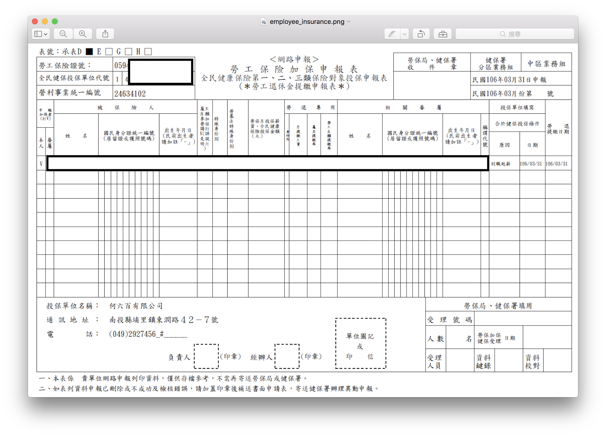

新進員工報到程序
===============================================================================

1. 完成員工聘雇合約的簽定
#. 決定員工的公司信箱帳號
#. 員工生成 4 年效期、 大於 2048bits 的 PGP key ， Email 部份即員工專屬的公司信箱，並上傳公錀至 pgp.mit.edu
#. 負責人在『員工到職日』開設員工的公司信箱，敝司信箱乃使用 Google Apps 服務，登入網址為 https://mail.google.com ，帳號要全部打全: xxx@ho600.com ，信箱密碼並以 PGP 公錀加密傳輸
#. 負責人在『員工到職日』為員工加保勞健保，並把申報表(範本如下圖)寄給員工保存
#. 員工需以『員工專屬之公司電子信箱』加入 bitbucket 網站，以及其他敝司所需相關服務網站或應用程式
#. 員工閱讀 https://bitbucket.org/ho600/general-affair/src/master/private-docs/index.rst 這裡全部文件

    勞健保申報表範本

GPG 相關應用說明
-------------------------------------------------------------------------------

.. code-block:: bash

    # 生成 PGP key pair
    $ gpg --gen-key
    gpg (GnuPG/MacGPG2) 2.0.30; Copyright (C) 2015 Free Software Foundation, Inc.
    This is free software: you are free to change and redistribute it.
    There is NO WARRANTY, to the extent permitted by law.

    Please select what kind of key you want:
       (1) RSA and RSA (default)
       (2) DSA and Elgamal
       (3) DSA (sign only)
       (4) RSA (sign only)
    Your selection? 1
    RSA keys may be between 1024 and 4096 bits long.
    What keysize do you want? (2048) 4096
    Requested keysize is 4096 bits
    Please specify how long the key should be valid.
    	 0 = key does not expire
          <n>  = key expires in n days
          <n>w = key expires in n weeks
          <n>m = key expires in n months
          <n>y = key expires in n years
    Key is valid for? (0) 4y
    Key expires at 五  7/16 08:32:07 2021 +08
    Is this correct? (y/N) y

    GnuPG needs to construct a user ID to identify your key.

    Real name: Yueh-Feng Ho
    Email address: hoamon@ho600.com
    Comment: https://www.ho600.com/insider/hoamon
    You selected this USER-ID:
        "Yueh-Feng Ho (https://www.ho600.com/insider/hoamon) <hoamon@ho600.com>"

    Change (N)ame, (C)omment, (E)mail or (O)kay/(Q)uit? O
    You need a Passphrase to protect your secret key.

    We need to generate a lot of random bytes. It is a good idea to perform
    some other action (type on the keyboard, move the mouse, utilize the
    disks) during the prime generation; this gives the random number
    generator a better chance to gain enough entropy.
    We need to generate a lot of random bytes. It is a good idea to perform
    some other action (type on the keyboard, move the mouse, utilize the
    disks) during the prime generation; this gives the random number
    generator a better chance to gain enough entropy.
    gpg: key 18807AE0 marked as ultimately trusted
    public and secret key created and signed.

    gpg: checking the trustdb
    gpg: 3 marginal(s) needed, 1 complete(s) needed, PGP trust model
    gpg: depth: 0  valid:  10  signed:   0  trust: 0-, 0q, 0n, 0m, 0f, 10u
    gpg: next trustdb check due at 2017-07-19
    pub   4096R/18807AE0 2017-07-17 [expires: 2021-07-16]
          Key fingerprint = A6F5 AFF3 5702 0AA2 448F  3442 5255 D197 1880 7AE0
    uid       [ultimate] Yueh-Feng Ho (https://www.ho600.com/insider/hoamon) <hoamon@ho600.com>
    sub   4096R/51DC8047 2017-07-17 [expires: 2021-07-16]
    $ gpg --keyserver pgp.mit.edu --send-keys 18807AE0

如果生成公私錀後，發現製作錯誤，且也上傳至 pgp.mit.edu 的話，請務必要使用該私錀去撤消公錀，\
不然其他人會誤用該把公錀來加密給你，徒增不必要的困惱，而手頭上不需要的私錀，也請在撤消遠端伺服器公錀後，方才刪除。

.. code-block:: bash

    # 撤消 PGP public key
    $ gpg --output ~/myrevoke.asc --gen-revoke <your_key_id>
    $ gpg --import ~/myrevoke.asc
    $ gpg --keyserver pgp.mit.edu --send-keys <your_key_id>
