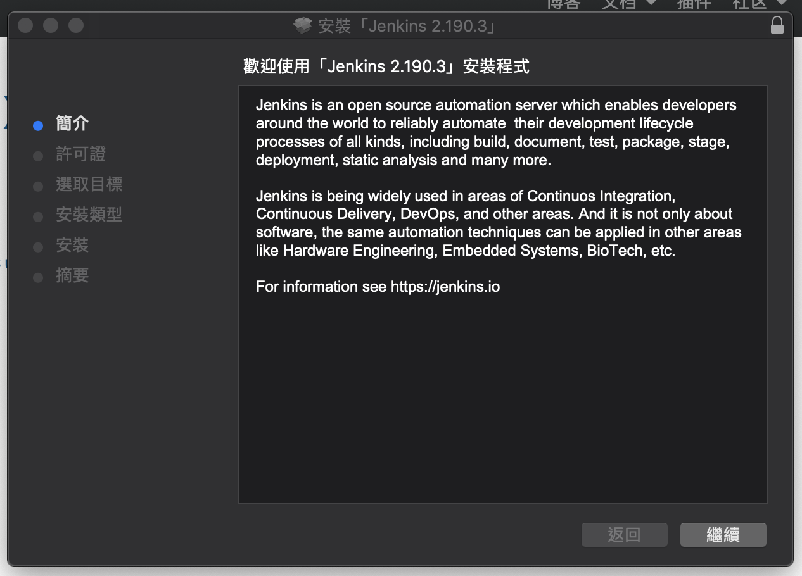
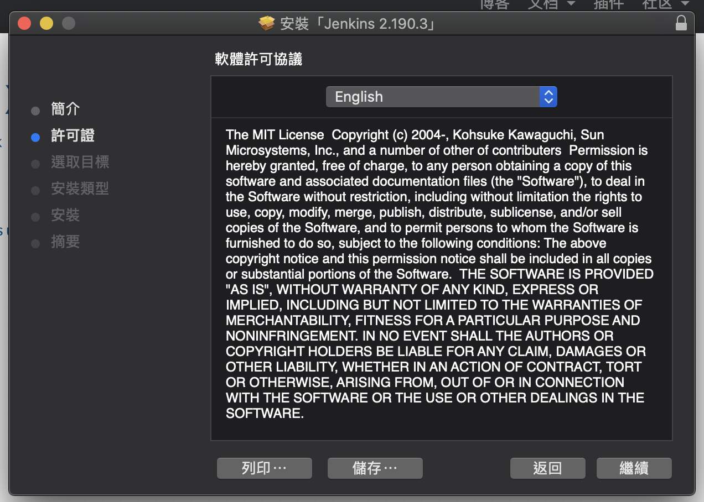
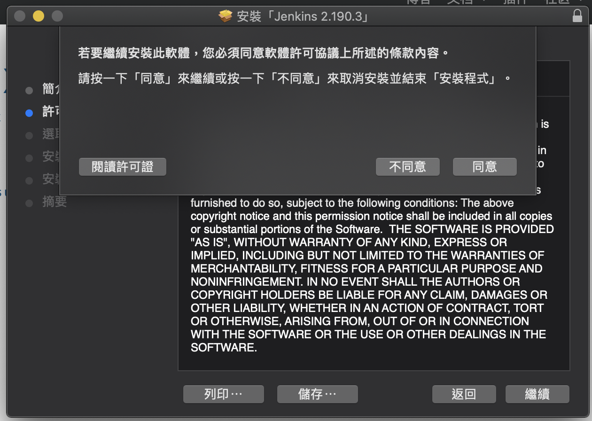
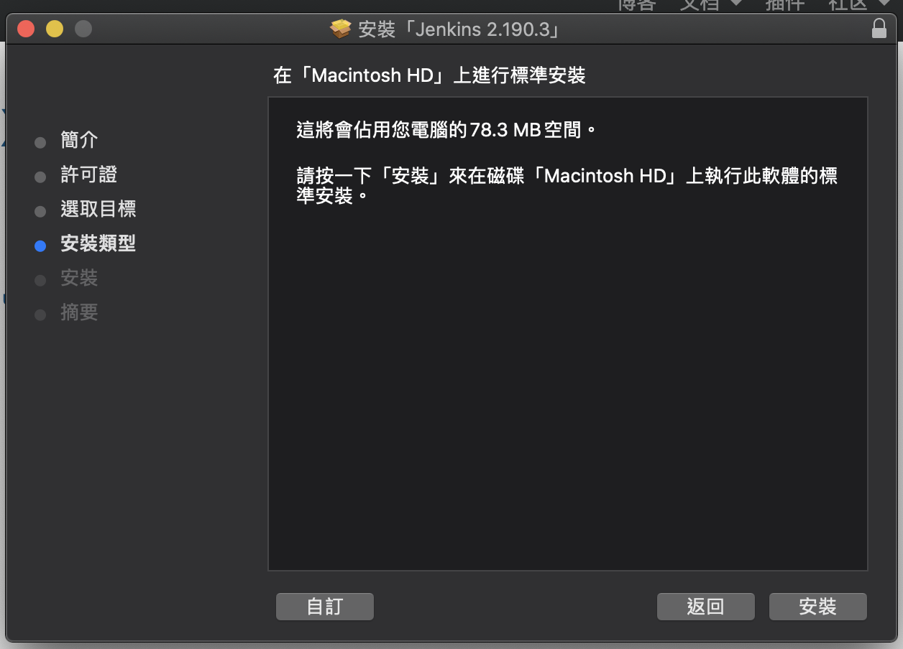
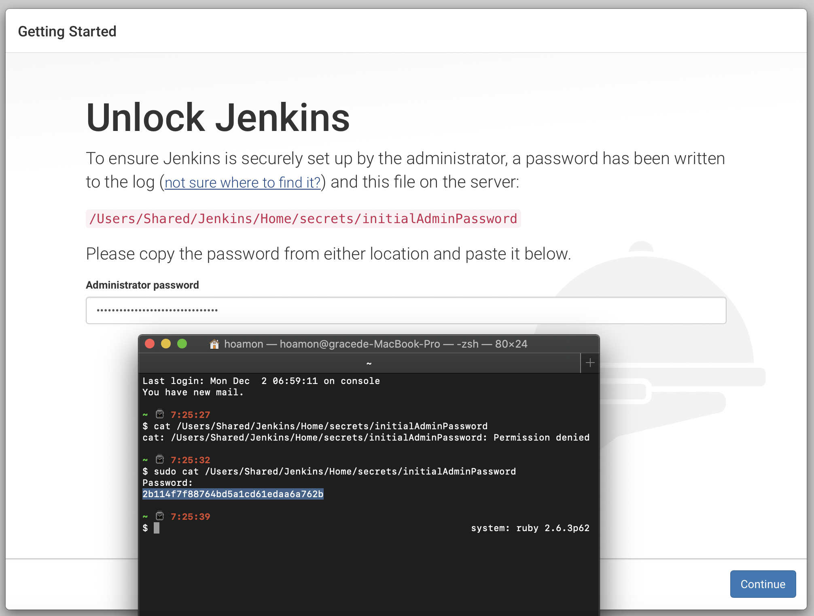
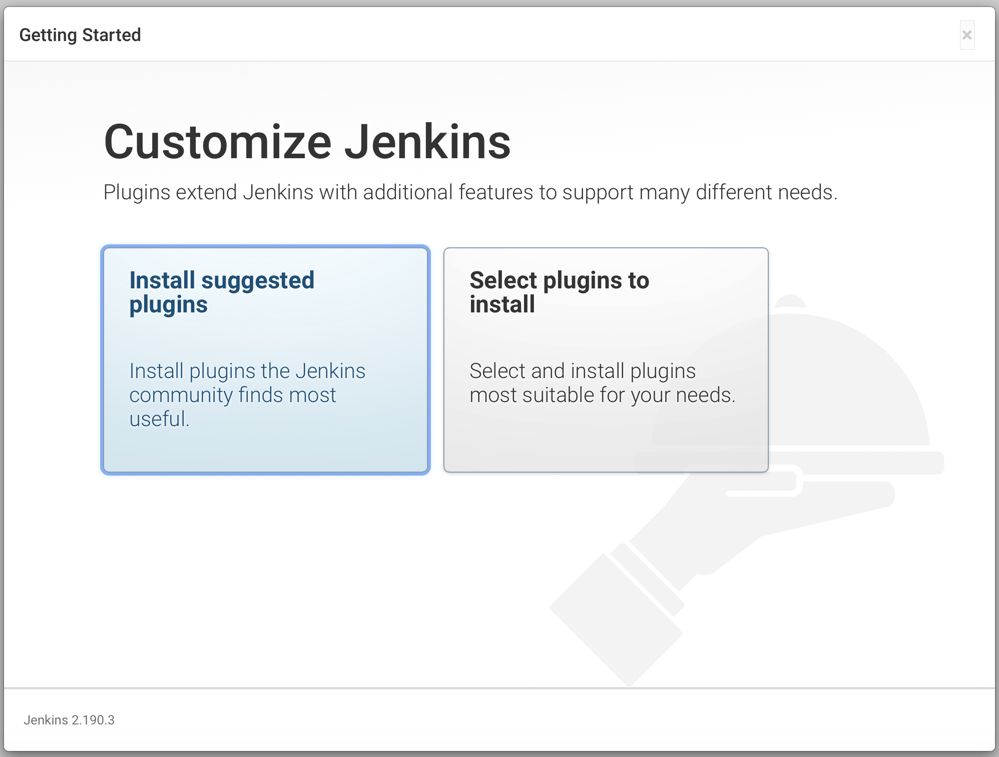
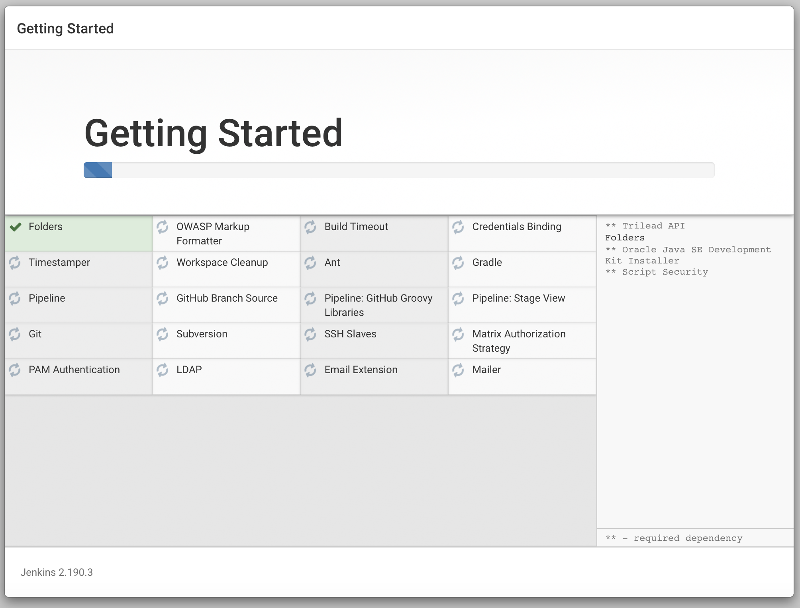
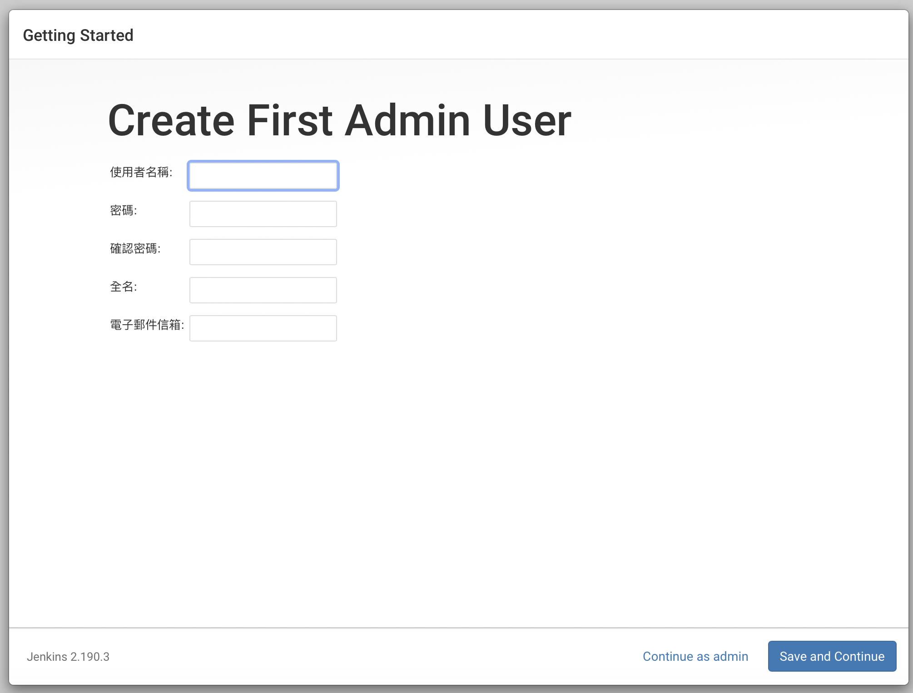
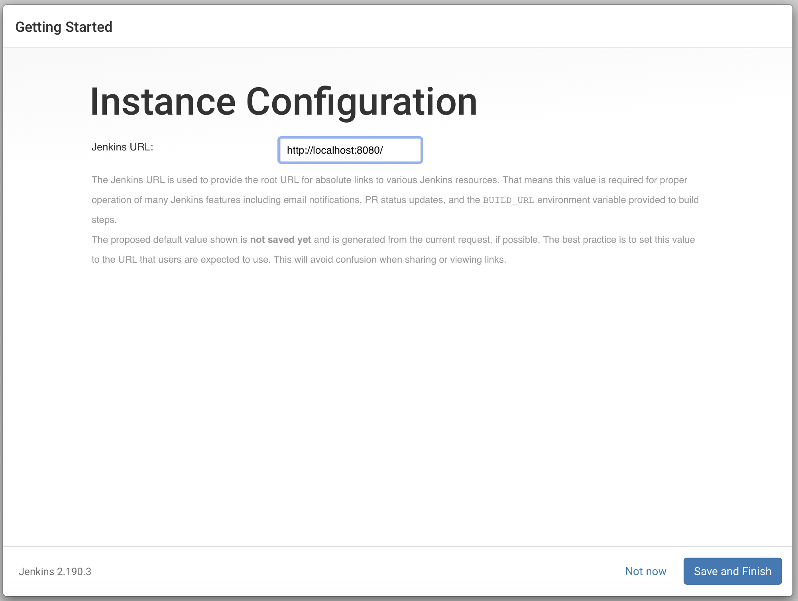
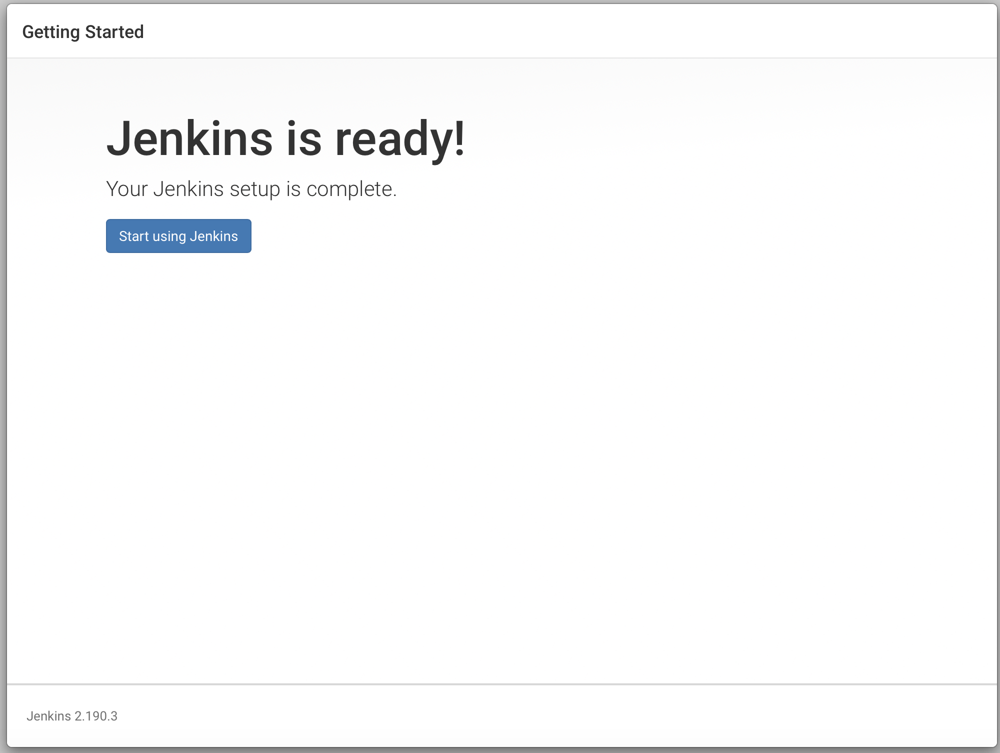

如何在 Jenkins 伺服器執行本地端的 AWS CodeBuild 專案建置 Sphinx 式文件網站?
===============================================================================

.. note::

    本文閱讀對象: 能在 AWS CodeBuild console 操作建置作業。

在軟體建置的方法上，敝司的操作經驗可以分成下列幾種:

1. 全部由 Jenkins 建置
#. 部份由 Atlassian Pipelines 建置，另外由 Jenkins 建置
#. 部份由 AWS CodeBuild 建置，另外由 Jenkins 建置
#. 全部由 AWS CodeBuild 建置
    * 在開發者本機端，則由 Jenkins 啟動 CodeBuild 建置

**第 1 種** 是敝司最早期的建置方式，在 AWS EC2 上安裝設定 1 台 Jenkins 伺服器，\
讓它把軟體建置加發佈一次跑完。

優點是設定簡單；\
缺點是無法同時滿足多個專案的建置、發佈需求，因為 Jenkins 本身跑在 JVM 上，\
有基本的記憶體需求，若有多個專案同時建置，那容易造成記憶體/CPU的需求尖峰過高，\
與我們在雲端運算的使用宗旨相背。\
微調方法是讓建置工作在開發者本地端的 Jenkins 伺服器處理，\
發佈工作則是送到 AWS EC2 上的 Jenkins 伺服器處理。\
建置 Jenkins 與發佈 Jenkins 之間當然得多了溝通工作。

**第 2 種** 是 Atlassian 在它們著名的 `Bitbucket Cloud <https://bitbucket.org/>`_ 服務中推出 Pipelines 後，\
敝司所採用的方式。將敝司軟體專案中，\
可獨立建置的全靜態網站或 Sphinx 文件式網站建置、發佈任務委由 Pipelines 處理。

優點是有效降低 Jenkins on EC2 的資源尖峰；\
缺點是 Bitbucket pipelines 與 AWS 是分屬不同的環境，設定步驟會多一點。\
但也由於我們所獨立建置的網站成果都是放在 S3 上面，所以麻煩程度並不會太高。\
另外，還有一個缺點，在建置過程中，若是需要用到資料庫，那就頭痛了，\
我們的測試資料庫都在 AWS 中，要讓 Pipelines 拿到資料、匯入資料庫，是辦得到，\
只是執行時間會多很多，而且設定步驟更加複雜。

**第 3, 4 種** 是在敝司將儲存庫從 Bitbucket Cloud 搬到自建的 Bitbucket Server 後採用的。

Codebuild 的計價方式是以每分鐘為單位，而我們在進行程式碼測試時，\
需要將正式資料庫備份到測試資料庫上，這裡的處置工作，在 CPU/記憶體上的用量不高，\
但耗費時間較久，用 CodeBuild 處理不划算。另外在建置階段，\
敝司也分成「本機端建置」與「伺服器端建置」，前者是由開發者在自己的開發平台上建置，\
第一時間驗證開發者自己寫的程式碼是否有問題。\
後者是在大家共用的伺服器上建置，這樣才能保有「明確、公用」的建置紀錄，\
在協作工作中，才能有「共通」的用語去指涉目標程式碼。

本文針對第 4 種方法中的開發者本機端如何使用 CodeBuild 建置 Sphinx-based 文件專案來作說明。

在 AWS console 執行 CodeBuild 作業
-------------------------------------------------------------------------------

下列是敝司其中一個 sphinx-based 文件庫所自帶的 buildspec.yml:

.. code-block:: yaml
    :linenos:

    version: 0.2

    env:
      git-credential-helper: yes

    phases:
      install:
        runtime-versions:
          python: 3.7
      pre_build:
        commands:
          - mkdir -p ~/.ssh/
          - unzip -P ${SSH_KEY_PASSWORD} id_rsa_awscodebuild.zip
          - mv id_rsa_awscodebuild ~/.ssh/
          - chmod 400 ~/.ssh/id_rsa_awscodebuild
          - echo 'Host git-codecommit.us-west-2.amazonaws.com \n StrictHostKeyChecking false \n User '${SSH_KEY_ID}' \n IdentityFile ~/.ssh/id_rsa_awscodebuild \n' >> ~/.ssh/config
          - export CODEBUILD_SRC_DIR_primary=$(pwd)
          - export CODEBUILD_SRC_2_DIR=$CODEBUILD_SRC_DIR_id2
          - export COMMIT_CHANGESET=$(git rev-parse HEAD)
          - export SHORT_COMMIT_CHANGESET=$(git rev-parse --short=7 HEAD)
          - export BUILD_TIME=$(date +%Y-%m-%dT%H:%M:%S%z)
          - mkdir -p docs/_build/html
          - echo '{ "CODEBUILD_BUILD_ID"':' "'${CODEBUILD_BUILD_ID}'",\n  "BUILD_TIME"':' "'${BUILD_TIME}'",\n   "COMMIT_CHANGESET"':' "'${COMMIT_CHANGESET}'" }' > docs/_build/html/__version__.json
          - pip install --upgrade pip
          - cp -rf docs/local_settings.py $CODEBUILD_SRC_2_DIR/trunk/local_settings.py
          - cd $CODEBUILD_SRC_2_DIR
          - pip install -r requirements.txt
          - cd $CODEBUILD_SRC_DIR_primary
          - pip install -r docs/requirements.txt
          - pip install --upgrade awscli
      build:
        commands:
          - cd docs/
          - make html
          - aws s3 cp --recursive _build/html s3://our-docs.ho600.com/DOC1/${COMMIT_CHANGESET}/

line 13 的目的，是在解壓縮某些私密的金錀。因為自動化建置、發佈所使用的程式碼儲存位置多是版本控制器，\
並不合適直接將這些隱私資訊以明碼方式放入版本控制器中。常規作法，是把它們用密語壓成 zip 檔，\
再儲存該 zip 檔到版本控制器上，另外把解密密語置入環境變數中。\
以此例來說， ${SSH_KEY_PASSWORD} 就是 AWS CodeBuild 專案的環境變數之一。

line 23 的目的是嵌入建置資訊到成果網站，\
如: `https://www.ho600.com/__version__.json <https://www.ho600.com/__version__.json>`_ 。

在 line 34 的 make html 中，因為文件庫有引入 $CODEBUILD_SRC_2_DIR 的程式碼，\
所以 $CODEBUILD_SRC_2_DIR 的配置必須是一個可運作的 Django-based 專案。\
這就是 line 25 的主要目的，讓 $CODEBUILD_SRC_2_DIR Django-based 專案擁有一個可運作的 settings.py 設定檔。

line 27 中的 requirements.txt 是 $CODEBUILD_SRC_2_DIR 的相依函式庫設定檔， \
line 29 則是本文件庫所需引入的相依函式庫，內容物通常只有 Sphinx==X.Y.Z 而已。

妥善編輯完 buildspec.yml 後，請先在 AWS CodeBuild console 中完成成功的建置工作，\
以確認 buildspec.yml 的格式及相關設定是正確的。

在命令列執行 local CodeBuild 作業
-------------------------------------------------------------------------------

AWS CodeBuild 執行建置作業是以 Docker 為基礎，\
每一次的建置都是拿某個 Docker image 生成的 container 來執行 buildspec.yml 中的步驟，\
敝司預設是使用 Ubuntu 18.04 的 \
`aws/codebuild/standard:2.0 <https://github.com/aws/aws-codebuild-docker-images/tree/master/ubuntu/standard/2.0>`_ \
映像檔(image)。如果程式碼是基於 Windows 或其他平台開發，\
也有 `其他映像檔 <https://docs.aws.amazon.com/codebuild/latest/userguide/build-env-ref-available.html>`_ 可以挑選。

而在本機端執行 CodeBuild 建置時，它也是以 Docker 為基礎作建置，\
所以是啟動一個 Docker container 去啟動另一個 Docker container 來執行 buildspec.yml 設定。\
當然，若是你的建置作業成果就是要打造一個 Docker image ，\
那就有 3 層 Docker container 同時在本機端運作。

最初始在本機端執行的 Docker container 只有 1 種 image 可供使用: `amazon/aws-codebuild-local <https://hub.docker.com/r/amazon/aws-codebuild-local/>`_ 。嚴格地講，\
你高興的話也能參考 amazon/aws-codebuild-local image 去打造自己的 image ，只是沒什麼必要。\
這個初始階段的 container 不過是一個啟動建置用 container 的角色，建置用 container 才是關鍵，\
建置用 container 受程式碼語言限制，要編譯 java ，那就得有 javac ；要處理 Django-based 專案，\
那就得安裝 Django ；初始啟動用的 container 用用 Amazon 官方提供的就行了。

.. note::

    這裡假設讀者已了解 Docker 入門應用: 安裝、執行等。

使用 Amazon 官方的 amazon/aws-codebuild-local 映像檔，很簡單，執行下列命令:

.. code-block:: bash

    $ docker pull amazon/aws-codebuild-local:latest --disable-content-trust=false

但不執行上述命令，也是可以的，因為在接下來的 codebuild_build.sh 執行過程中，\
發現你還沒有 amazon/aws-codebuild-local 的映像檔，它也是會詢問你要不要下載。

本機要使用的「建置用的 container image 」就得從 Dockerfile 自行 build ，\
請上 AWS 官方儲存庫 `aws/aws-codebuild-docker-images <https://github.com/aws/aws-codebuild-docker-images/>`_ ，\
敝司使用 ubuntu/standard/2.0/Dockerfile 來 build 建置用 container image :

.. code-block:: bash

    $ git clone git@github.com:aws/aws-codebuild-docker-images.git
    $ cd aws-codebuild-docker-images/ubuntu/standard/2.0/
    $ docker build -t aws/codebuild/ubuntu:std2.0 .

這個 build 步驟會花不少時間。 build 後，可以列表出來了解:

.. code-block:: bash

    $ docker images
    REPOSITORY                   TAG                 IMAGE ID            CREATED             SIZE
    aws/codebuild/ubuntu         std2.0              b11b09aa6635        4 days ago          8.07GB
    amazon/aws-codebuild-local   latest              b0bdf3d66f0e        4 months ago        563MB

要啟動這個本機端 codebuild 作業，可以透過 `aws-codebuild-docker-images/local_builds/codebuild_build.sh <https://github.com/aws/aws-codebuild-docker-images/blob/master/local_builds/codebuild_build.sh>`_ 來執行:

.. code-block:: bash

    $ ~/bin/codebuild_build.sh \
    -i "aws/codebuild/ubuntu:std2.0" \
    -a out/ \
    -e variables.env \
    -s REPO_1/ \
    -b REPO_1/docs/buildspec.yml \
    -s repo_2:REPO_2 \
    -c ~/.aws/

**請注意** ，指令中的 REPO_1/ 與 REPO_2/ 中檔案都是以「複製(copy)」的方式被載入進 \
"aws/codebuild/ubuntu:std2.0" container 中，\
所以若是內有不需要的大檔案(例: sql dump file, virtualenv dir)，\
要挪到 REPO_1/, REPO_2/ 之外放置，不然每次建置時，都會多複製這些無用的檔案，徒耗時間。\
只是目前 .git/ 是免不了的。 

前述的 codebuild_build.sh 執行時會轉成原始 docker 指令後執行，\
所以也可以直接下這個 docker 指令來執行 codebuild 建置作業:

.. code-block:: bash

    $ docker run -it -v /var/run/docker.sock:/var/run/docker.sock \
    -e "IMAGE_NAME=aws/codebuild/ubuntu:std2.0" \
    -e "ARTIFACTS=/Users/hoamon/VSCProjects/out/" \
    -e "SOURCE=/Users/hoamon/VSCProjects/REPO_1/"
    -e "SECONDARY_SOURCE_1=repo_2:/Users/hoamon/VSCProjects/REPO_2" \
    -e "BUILDSPEC=/Users/hoamon/VSCProjects/REPO_1/docs/buildspec.yml" \
    -v "/Users/hoamon/VSCProjects:/LocalBuild/envFile/" \
    -e "ENV_VAR_FILE=variables.env" \
    -e "AWS_CONFIGURATION=/Users/hoamon/.aws" \
    -e "INITIATOR=hoamon" \
    amazon/aws-codebuild-local:latest # 此為初始啟動 codebuild 作業的 container image;
    # 而 IMAGE_NAME=aws/codebuild/ubuntu:std2.0 指的是建置用的 container image

    Removing network agent-resources_default
    Removing volume agent-resources_source_volume
    Removing volume agent-resources_user_volume
    Creating network "agent-resources_default" with the default driver
    Creating volume "agent-resources_source_volume" with local driver
    Creating volume "agent-resources_user_volume" with local driver
    Creating agent-resources_agent_1 ... done
    Creating agent-resources_build_1 ... done
    Attaching to agent-resources_agent_1, agent-resources_build_1
    agent_1  | [Container] 2019/12/03 09:25:33 Waiting for agent ping
    ...
    ...
    upload: _build/html/search.html to s3://our-docs.ho600.com/DOC1/4403d49a263188df01687d059eb39e36305caec7/search.html
    upload: _build/html/searchindex.js to s3://our-docs.ho600.com/DOC1/4403d49a263188df01687d059eb39e36305caec7/searchindex.js
    upload: _build/html/_downloads/fa72967150e33f4d81f38f26a4d57edf/20190721-schema-graph-image.png to s3://our-docs.ho600.com/DOC1/4403d49a263188df01687d059eb39e36305caec7/_downloads/fa72967150e33f4d81f38f26a4d57edf/20190721-schema-graph-image.png
    agent_1  | 
    agent_1  | [Container] 2019/12/03 09:28:40 Phase complete: BUILD State: SUCCEEDED
    agent_1  | [Container] 2019/12/03 09:28:40 Phase context status code:  Message: 
    agent_1  | [Container] 2019/12/03 09:28:40 Entering phase POST_BUILD
    agent_1  | [Container] 2019/12/03 09:28:40 Phase complete: POST_BUILD State: SUCCEEDED
    agent_1  | [Container] 2019/12/03 09:28:40 Phase context status code:  Message: 
    agent-resources_agent_1 exited with code 0
    Stopping agent-resources_build_1 ... done
    Aborting on container exit...
    $ 

**值得注意** 的是，我們在本機端建置用的 container image 是基於 aws/codebuild/ubuntu:std2.0 版，\
這個 image 必須與我們在 AWS CodeBuild console 中所執行作業採用的 image 一致，\
這樣才能避免因為兩者 image 不同下，本機端建置成果與 AWS 平台建置成果不一致。

若是在 AWS 平台建置時，對於 container image 有特殊需求，例如: 須安裝 Django-2.2.6 及其他函式庫，\
但又不想每次建置都要重覆執行安裝這些函式庫。那可以 aws/codebuild/ubuntu:std2.0 為基礎，\
訂製新版 image ，並 push 到 AWS ECR ，讓 AWS CodeBuild 及本機端同時使用相同的 container image 。

結合 Jenkins 執行 local CodeBuild 作業
-------------------------------------------------------------------------------

前一節中，我們已經可以在命令列執行 local CodeBuild 專案的建置作業，\
成功模擬 AWS 平台上的 CodeBuild 建置作業。

使用純命令列麻煩的是，每次在操作時，\
就要用 history|grep "codebuild_build.sh" 來找出參數，\
如果開發者手頭只管理一個軟體專案，那這個 **呀雜** 的動作還能接受，\
但事實上，只管一個專案的可能性很低，以敝司來說，平均每個工程師關係 6 個以上的專案，\
且同一個專案還分為「正常網站」及「測試網站」，\
有的「測試網站」還分為「功能測試網站」及「發佈測試網站」，\
這樣在建置層級，就關係到 12 個以上的網站。

在 AWS 平台上，可以在 CodeBuild console 總覽所有軟體專案的建置作業，\
那在本機端，我們就利用 Jenkins 來統籌所有建置作業。

下面簡單說明 Jenkins 伺服器的安裝、設定步驟，\
安裝檔請至 `https://jenkins.io/download/ <https://jenkins.io/download/>`_ 下載:

    閱讀說明

    閱讀軟體許可協議

    同意軟體許可協議

    同意安裝

.. figure:: execute_local_aws_codebuild_project/Jenkins05.png
    :align: center
    :width: 600px

    安裝完成

    以 sudo cat /Users/Shared/Jenkins/Home/secrets/initialAdminPassword 指令來驗證得到「電腦系統管理員」身份，以設定 Jenkins 伺服器

    安裝建議的套件

    安裝套件中

    新增 Jenkins 伺服器的「網站管理員身份」

    以 http://localhost:8080/ 為 Jenkins 伺服器的瀏覽網址

    完成設定，並可啟動 Jenkins 伺服器

請以「網站管理員」登入 http://localhost:8080/ 後，並新增一項作業:

1. 點擊「新增作業」
#. 作業命名，建議同 AWS CodeBuild 上的作業同名
#. 作業類型請選「建置 Free-Style 軟體專案」
#. 點擊「Ok」按鈕以新增作業，接下來，會直接跳到作業設定頁
#. 原始碼管理請選取「無」
#. 建置環境可勾選「Color ANSI Console Output」，並在 ANSI color map 選取 xterm 。需安裝 AnsiColor 套件，方有此設定
#. 「建置」區塊，請在新增建置步驟上選取「執行 Shell」，執行 Shell 的指令區塊要填入「啟動 docker 的指令」，容後說明
#. 按下「儲存」按鈕

前述所談的「啟動 docker 的指令」並不是把 /Users/xxx/bin/codebuild_build.sh -i ... 或是 docker -it ... 直接代入即可。\
因為 Jenkins 伺服器的運作身份是 jenkins ，而先前所使用的啟動 docker 指令都是以一般使用者的身份去執行的， \
Docker images 的擁有者也是一般使用者。所以比較便宜行事的方式，\
就是讓 jenkins 用戶可以轉成一般使用者身份去執行「啟動 docker 指令」。

首先，調整系統權限，在 /etc/sudoers 增加一行設定如下:

.. code-block:: text

    jenkins    ALL=(hoamon) NOPASSWD: /usr/local/bin/docker # jenkins 用戶可以從 ALL host 登入後，以 hoamon 身份，無需密碼去執行 /usr/local/bin/docker 指令。

這樣，「啟動 docker 指令」就可填入如下:

.. code-block:: bash

    sudo -u hoamon docker run \
    -v /var/run/docker.sock:/var/run/docker.sock \
    -e "IMAGE_NAME=aws/codebuild/ubuntu:std2.0" \
    -e "ARTIFACTS=/Users/hoamon/VSCProjects/out/" \
    -e "SOURCE=/Users/hoamon/VSCProjects/REPO_1/"
    -e "SECONDARY_SOURCE_1=repo_2:/Users/hoamon/VSCProjects/REPO_2" \
    -e "BUILDSPEC=/Users/hoamon/VSCProjects/REPO_1/docs/buildspec.yml" \
    -v "/Users/hoamon/VSCProjects:/LocalBuild/envFile/" \
    -e "ENV_VAR_FILE=variables.env" \
    -e "AWS_CONFIGURATION=/Users/hoamon/.aws" \
    -e "INITIATOR=hoamon" \
    amazon/aws-codebuild-local:latest

與先前指令相較，要移除 **-it** 參數。 i 代表會詢問用戶輸入值， t 代表使用 tty 為終端介面。\
此兩者都無法在 jenkins 作業中使用。

到這裡就完成以 Jenkins 控管 local CodeBuild 作業的操作。而敝司在實務上，\
為方便更有效率管理這些建置作業，會讓「啟動 docker 指令」以如下形式填入:

.. code-block:: bash

    /Users/hoamon/VSCProjects/My_Software_Project/bin/jenkins_execute_local_codebuild.sh \
    "amazon/aws-codebuild-local:latest" \
    "ho600/docker-hub:ubuntu2.0" \
    "hoamon" \
    "/Users/hoamon/.aws" \
    "/Users/hoamon/VSCProjects" \
    "My_Software_Project" \
    "docs/buildspec.yml" \
    "repo_2" \
    "/Users/hoamon/VSCProjects" \
    "REPO_2" \
    "\*\*\*" \
    "APK\*\*\*"

這樣在不同的 jenkins 作業中，「啟動 docker 指令」的內容都會是類似的，\
而我們可以把專案條件差異的部份在 jenkins_execute_local_codebuild.sh 中處理:

.. code-block:: bash

    #!/bin/zsh
    # /Users/hoamon/VSCProjects/My_Software_Project/bin/jenkins_execute_local_codebuild.sh

    LOCAL_CODEBUILD_IMAGE_NAME=$1 #"amazon/aws-codebuild-local:latest"
    BUILD_IMAGE_NAME=$2 #"ho600/docker-hub:ubuntu2.0"
    EXCUTOR=$3 #"hoamon"
    AWS_CONFIGURATION_DIR=$4 #"/Users/hoamon/.aws"

    SOURCE_DIR=$5 #"/Users/hoamon/VSCProjects"
    REPOSITORY_NAME=$6 #"My_Software_Project"
    BUILDSPEC_FILE=$7 #"docs/buildspec.yml"

    SECONDARY_SOURCE_1=$8 #"repo_2"
    SOURCE_2_DIR=$9 #"/Users/hoamon/VSCProjects"
    REPOSITORY_2_NAME=${10} #"REPO_2"

    SSH_KEY_PASSWORD=${11} #"\*\*\*"
    SSH_KEY_ID=${12} #"APK\*\*\*"

    ARTIFACTS=${SOURCE_DIR}"/artifacts_out"

    cat << EOF > ${REPOSITORY_NAME}.env
    WHATEVER=_WHATVALUE_
    SSH_KEY_PASSWORD=${SSH_KEY_PASSWORD}
    SSH_KEY_ID=${SSH_KEY_ID}
    EOF

    sudo -u ${EXCUTOR} /usr/local/bin/docker run \
    -v /var/run/docker.sock:/var/run/docker.sock \
    -e "IMAGE_NAME=${BUILD_IMAGE_NAME}" \
    -e "ARTIFACTS=${ARTIFACTS}" \
    -e "SOURCE=${SOURCE_DIR}/${REPOSITORY_NAME}" \
    -e "SECONDARY_SOURCE_1=${SECONDARY_SOURCE_1}:${SOURCE_2_DIR}/${REPOSITORY_2_NAME}" \
    -e "BUILDSPEC=${SOURCE_DIR}/${REPOSITORY_NAME}/${BUILDSPEC_FILE}" \
    -v "${SOURCE_DIR}:/LocalBuild/envFile/" \
    -e "ENV_VAR_FILE=${REPOSITORY_NAME}.env" \
    -e "AWS_CONFIGURATION=${AWS_CONFIGURATION_DIR}" \
    -e "INITIATOR=${EXCUTOR}" ${LOCAL_CODEBUILD_IMAGE_NAME}

而且 jenkins_execute_local_codebuild.sh 有在 git 儲存庫中追蹤，若有建置問題，\
也好查明問題點。