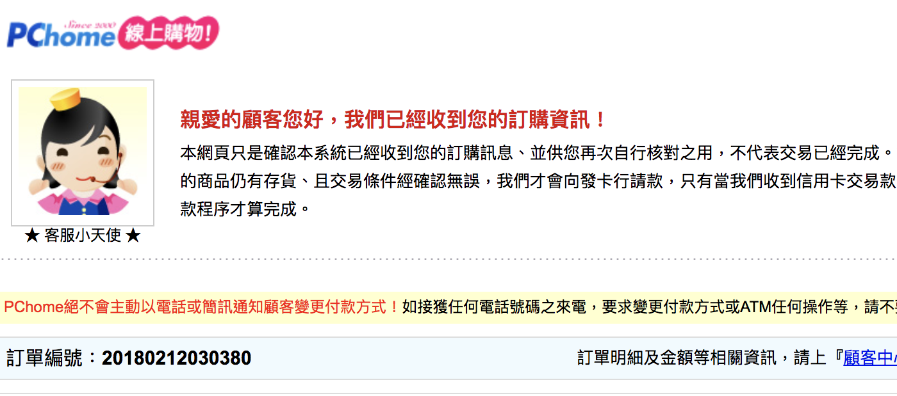
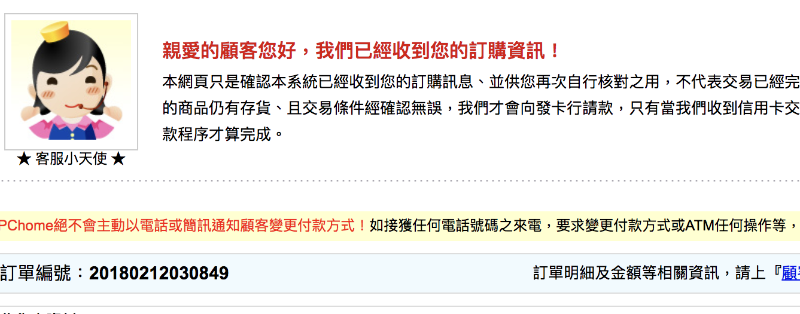

雞年年終抽獎規則
===============================================================================

規則目標
-------------------------------------------------------------------------------

1. 公平
#. 公開
#. 有趣
#. 獎額自行掌握

獎額公佈時間
-------------------------------------------------------------------------------

2018年02月12日 14時30分0秒(+08:00)公佈。

員工自行填報獎品期限
-------------------------------------------------------------------------------

2018年02月12日 10時00分0秒(+08:00)前，寄信到 hoamon@ho600.com 。

獎額計算公式
-------------------------------------------------------------------------------

以2018年02月12日臺北股市最終收盤價為輸入值，若當日未有收盤價，則以 10371.75 為輸入值。\
轉換步驟如以下 Python 程式:

.. literalinclude:: ./luck_draw_amount.py

lucky_draw_amount 函式的輸出值即為可兌獎金額。員工自選獎品的實際總訂單金額低於或等於可兌獎金額，即為「中獎」; 而實際總訂單金額超過可兌獎金額者，即為「未中獎」。

員工自選獎品
-------------------------------------------------------------------------------

限至以下線上購物網站，挑選商品。商品種類、數量可多個，惟整份訂單須在單一網站下單:

* https://www.pinkoi.com/store/xpirit
* https://www.bio-enzyme.com/
* http://24h.pchome.com.tw/
* http://shopping.pchome.com.tw/
* http://www.books.com.tw/
* http://www.momoshop.com.tw/index.html
* https://www.trplus.com.tw/
* https://www.apple.com/tw_smb_101387/shop

將挑選商品的展示連結(可下單、有價格的連結)集結起來，\
加上『預估總訂單金額(要含運費、購物手續費…)』，\
所有內容以個人私錀作明文簽章，寄到 hoamon@ho600.com ，\
我會將整份獎品清單內文及明文簽章填寫回本文件以供證明。\
如果不想讓其他人知道你的獎項為何? 請另創 PGP 公私錀。

員工自選獎品明細
-------------------------------------------------------------------------------

Key id(5C4561A4595374F2) 的獎品明細:

.. code-block:: text

    https://24h.pchome.com.tw/prod/DGCC77-A9008E3T9 9480*1
    預估總訂單金額為 9480 元

    -----BEGIN PGP MESSAGE-----
    Version: GnuPG v1

    owEBmAJn/ZANAwACAVxFYaRZU3TyAaxoYglobzYwMC50eHRagPOVaHR0cHM6Ly8y
    NGgucGNob21lLmNvbS50dy9wcm9kL0RHQ0M3Ny1BOTAwOEUzVDkgOTQ4MCoxCumg
    kOS8sOe4veioguWWrumHkemhjeeCuiA5NDgwIOWFgwqJAhwEAAECAAYFAlqA85UA
    CgkQXEVhpFlTdPKn5g//YgGBPomfssLp/NokKt3LTjv7P+nfw0uZS/C5qGM6YBtj
    Gf9UoE026f27DG8kEw1J7YoFPVsfeYmCaM+jgGEf+2j7b+CJFCLzAmIyI14a3UiY
    Xihxqjfj2koAWB+S1cDUYf82oYw/SGyD01FBZRgUbz48VzggBIL0FE6Git248wYQ
    zGl4SI0sGexEr/lDtqweCIcbXyJLSDtKbA7rgeSOh464s5MZAHKsMeAjPoWk310w
    mVevlZNoy4IGTxIsyvkuYOLSdF4hW0X2md4vNG+56URSe3CWLZ5MvHnyT0tC0boN
    awKgKowPFjqXN/CeIK8XaPk0WYBmKX1fQh4gI2tlUvIIP1jmBNCB0CLp/sAm1Krs
    UkD2EGvfDoP0qdSt/PThJ6Zp2/dMGWE4WNmMbXRcpm+WS/cm/XBc4YliYXaj2nKl
    qFY9DXgEPWipc3P2WYWWRIwn+SwC3lVpPduoIquMsJlzi//Odffo10GA/BUOe0q/
    55gfGB9nKrtkSXk5/NY0F0XNQgcqlM1tRsZWM88U1FnvY8k61LWZBdSS/jUI4J6M
    WUw7E3he5UB3e1srY3qOd3f6soSMfwuIthHT4aNjRTjkcr6OMsjbpAM2v9YyMdu8
    1Zhm0eDHN0dR6nDuX12Rk0a74utBKMNt8eHh2uVXpSEnk7z9BUuDw0i3t9tYYQY=
    =IDiy
    -----END PGP MESSAGE-----

Key id(D2D899B1F7FB656E) 的獎品明細:

.. code-block:: text

    -----BEGIN PGP SIGNED MESSAGE-----
    Hash: SHA1

    https://www.apple.com/tw_smb_101387/shop/product/HL5B2ZM/A/twelve-south-parcslope-%E7%AB%8B%E6%9E%B6-%E9%81%A9%E7%94%A8%E6%96%BC-macbook-%E8%88%87-ipad-pro?fnode=8a

    約 1750 元
    https://www.apple.com/tw_smb_101387/shop/buy-tv/apple-tv-4k/32gb + AppleCare Protection Plan 約 5990+1090 元

    總訂單約 8830 元
    -----BEGIN PGP SIGNATURE-----
    Version: GnuPG v1

    iQEcBAEBAgAGBQJagPEsAAoJENLYmbH3+2Vu5u8H/An/eDsiSWJ6HgTiMqJtZrcW
    KYg2XXZTvcLHCDyyXZeAgtCB4C8JPqcqVWIIDB3PjUNc9jPLHxNWA7sUIgI0/fJP
    WxVs4mj5lDsWMYEnYaOQvzAX2kRUwbOqdoxFywA0mG8FVjbBBJxloy3fluvuTgdJ
    PVxQ9sXBmTwtU2R0oqA9loVKEGbZk8IRppEdNeyB3vomfqloE0ZvAgEX3qXBytkH
    G3Pt+MFOkrclR5w8L86ndBCIdggPsOd3Bihmq3VaeCGp0xXrmV3XTzzQmJEyevZ4
    5fcs5y/c59YWb1GieIU6gCBX52u9ZQR6BW7VPEkshSmsF7NjnUsILk7/czX3jKI=
    =/Rd8
    -----END PGP SIGNATURE-----

Key id(92A30B9DB0F99CBF06CAFD7C15536A7D4F1067AB) 的獎品明細:

.. code-block:: text

    -----BEGIN PGP SIGNED MESSAGE-----
    Hash: SHA256

    https://24h.pchome.com.tw/prod/DGAD5I-A9007G643
    SJCAM SJ5000 防水運動型攝影機 $3490

    -----BEGIN PGP SIGNATURE-----

    iQEzBAEBCAAdFiEEkqMLnbD5nL8Gyv18FVNqfU8QZ6sFAlqA8jEACgkQFVNqfU8Q
    Z6vIPAf+OqcK4O6RQJhZNjWdVtjpurMfEFAhAEHJiteY7khOSceLvPNuj45+Ykdn
    d4MXsCTF4SfCdxCMM5u+T2RWxKFfMQk0/0hXBDamN4ScpbuYU/PhOtNbprT312ru
    WBxGiZLOSFyCYzPr9jY6McMIbn7+DcChDF9q2UnOdYJtTkmtfZypeM1boD4xNJSK
    D5nZQfDUleeKr2clQqi02Map9MgvFWOaX/9Mhb5AORTbFxb0JiExvDghNYrxgEIC
    F62D/9HRhpwZwLWZJBy/FXbO4Be0y5Ms+OyO0KCF7YDmKXPOZFkkjh6LknZsifRe
    pUtb2UF4gjdhcZvHcff7C0Odw9C3Ow==
    =A2fK
    -----END PGP SIGNATURE-----

Key id(202AF629DF94884E77287E6445B9609A64A13A7C) 的獎品明細:

.. code-block:: text

    -----BEGIN PGP SIGNED MESSAGE-----
    Hash: SHA256

    https://24h.pchome.com.tw/prod/DCAH0X-A90084FN6?q=/S/DCAHDS 英文版*1
    預估總訂單金額為 3,190 元
    -----BEGIN PGP SIGNATURE-----

    iHUEAREIAB0WIQQgKvYp35SITncofmRFuWCaZKE6fAUCWoBSPQAKCRBFuWCaZKE6
    fDKyAP9hRGSTPvzolk7EumfC3LlNbsTcB0ffMrF2XO5T5MYNEQEAhtKJGrRPAdVN
    hX32zmuW4D7k3hC38wPTK3tJlks/KWY=
    =vMY5
    -----END PGP SIGNATURE-----

但書
-------------------------------------------------------------------------------

1. 所挑選獎品統一由敝司下單
#. 所挑選獎品須於 2018 年 02 月 12 日 14:30 ~ 15:30(+08:00) 為可購買的狀態，連結失效、缺貨即不列入總訂單金額內
#. 得到的獎品須依中華民國稅務相關法律辦理扣繳、申報
#. 規則若有爭議，由敝司仁慈的獨裁者仲裁、解釋

總結
-------------------------------------------------------------------------------

希望大家玩得開心。而最終 2018 年 02 月 12 的臺北股市加權指數收盤價為 10421.09 ，代入如下程式:

.. literalinclude:: ./final_lucky_draw_amount.py

可兌獎金額為 4327.731520843061 元，恭喜 92A30B9DB0F99CBF06CAFD7C15536A7D4F1067AB, 202AF629DF94884E77287E6445B9609A64A13A7C 兩位得主。

訂單編號如下:

